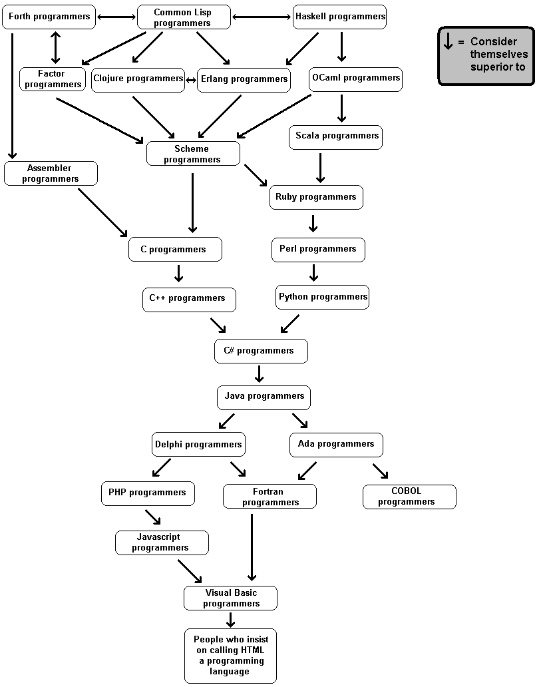
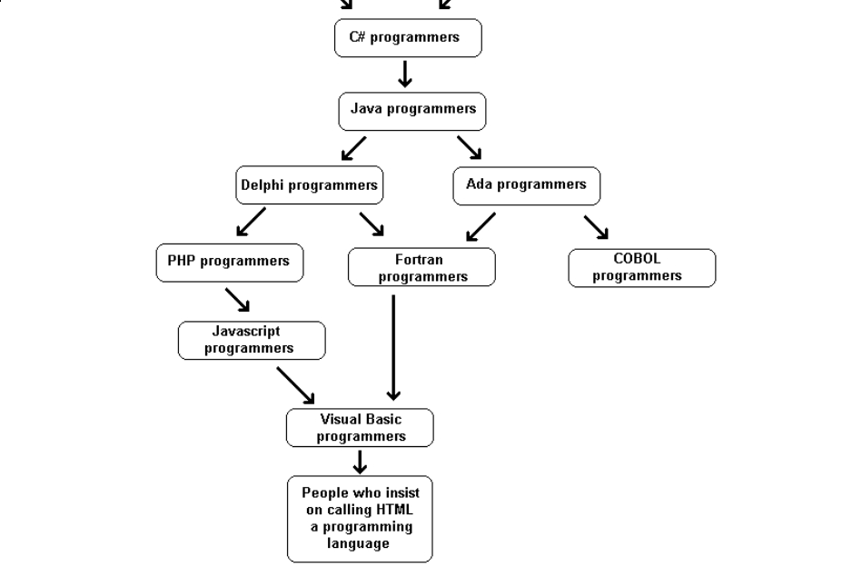
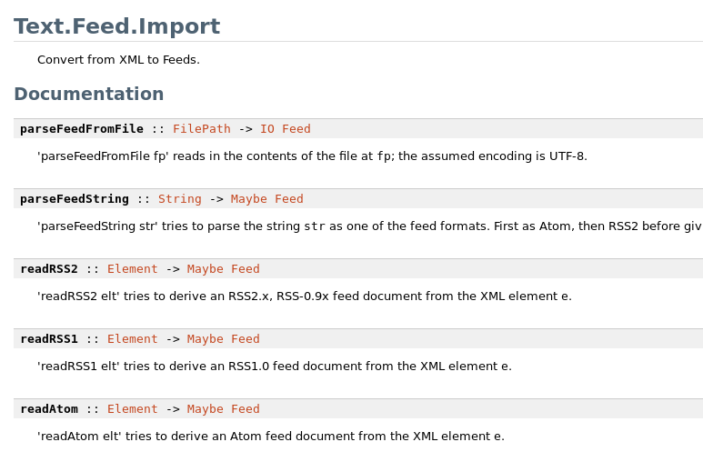

# Haskell: coding like a vulcan

---

# Haskell

- langage de programmation fonctionnel pure lazy
- typage statique fort
- compilé
- de la famille des langages de type "ml"

Autres features/caractéristiques:

- shell (ghci)
- cabal
- hoogle
- bonnes perfs (~java sans la jvm)
- inférence de types
- extrêmement solide
- extrêmement expressif
- malheureusement très difficile

---

# Pourquoi apprendre haskell?

- radicalement différent de ce que vous connaissez
- fera de vous un meilleur dev
- très éléguant
- puissant
- concurrence (structures de données immutable)
- lazy
- secteur à pointe de la recherche dans les langages de programmation
- vos amis serons jaloux

---

---

---

# Les visages d'haskell

---

---

---

# Hello world!

    !haskell
    main = putStrLn "Hello World!"

---

# a = 1

---

# add1 target = target + 1

---

# add1 41 -- -> 42

---

# Hello world!

    !haskell
    main = putStrLn "Hello World!"

---

# Clef de lecture numéro 1:   « Les mathématiciens sont des branleurs »

---

# Les fonctions

- elles sont « pures »
- pas possible d'acceder à un contexte globale et de le modifier
- pas de "variable"/modification de variable
- ne prennent qu'une seule expression
- est obligatoirement retournée la valeur de l'expression
- très proche d'une fonction « mathématique »
- sont considéré comme des valeurs (→ peuvent être passé en argument)
- impossible d'y faire des effets de bords (side-effect)
- rend haskell très solide (car empêche plein de sources de bugs)
- rend haskell très difficile

---

# Trucs classiques

    !haskell
    1
    1.2
    1e10
    1 + 2 * 3
    True && False || True
    1 + 1 == 11
    1 + 1 /= 11
    'c' -- char
    "string" -- (list de chars)
    [1, 2, 3] -- list, tout du même type
    1:2:3:[] -- aussi list
    [1,2] ++ [3] == [1,2,3]
    (1, "pouet", 'c') -- tuple
    [1..3] -- == [1,2,3] range
    [1..] -- range infinie !
    [x*2 | x <- [1..10], x < 42] -- list compréhension
    if True then "pouet" else "plop" -- même type de retour

    a %+% b = (a + b) / 2 -- fonction infixe

    \x -> 1 + x -- lambda

    (+) 1 2
    4 `div` 3

---

# Pattern matching

    !haskell
    luckyNumber number = if number == 7 then "Lucky!" else "Fail"

Avec du pattern matching:

    !haskell
    luckyNumber 7 = "Lucky!"
    luckyNumber number = "Fail"

Et avec le "\_":

    !haskell
    luckyNumber 7 = "Lucky!"
    luckyNumber _ = "Fail"

---

# Encore plus de pattern matching

Rappel sur les listes:

    !haskell
    [1, 2, 3] == 1:2:3:[]

On peut faire du pattern matching dessus:

    !haskell
    head (x:xs) = x -- les () sont là pour la priorité d'évaluation

    tail (x:xs) = xs

    len [] = 0
    len (x:xs) = 1 + len xs

Exemple, "len [1,2,3]" donnera:

    len [1,2,3]
    match len (x:xs)
    len (1:[2,3]) = 1 + len [2,3]
    -> len (2:[3]) = 1 + len [3]
    -> len (3:[]) = 1 + len []
    -> len [] = 0

    Donc:
    len [1,2,3] = 1 + 1 + 1 + 0

---

# Quicksort

Pour la blague:

    quicksort [] = []
    quicksort (x:xs) = (quicksort [a | a <- xs, a <= x]) ++ [x] ++\
                       (quicksort [a | a <- xs, a > x])

---

# Structures de contrôle

Guards:

    !haskell
    est_1 a
      | a == 1    = True
      | a == 2    = False
      | otherwise = False

Case:

    !haskell
    est_1 a = case a of 1 -> True
                        2 -> False
                        3 -> False
                        _ -> False

---

# Where/let it be

Where (are you?):

    !haskell
    plus_42_fois_3 a = a + 42_fois_3
        where 42_fois_3 = 42 * 3

Let (it be):

    !haskell
    plus_42_fois_3 a =
        let 42_fois_3 = 42 * 3
        in a + 42_fois_3

---

# le $ de branleur

Rappel: clef de lecture numéro 1

    !haskell
    function1 (fonction2 (fonction3 (fonction4 (argument))))
    -- peut s'écrire
    function1 $ fonction2 $ fonction3 $ fonction4 $ argument

---

# Pfiou, questions ?

---

# Gros point fort d'haskell

- vrai typage qui aide (pas comme c/c++/autre)
- puissant, générique, facile à utiliser
- inférence de type -> tout le code haskell que je vous ai montré est valide !
- ghc détermine les types de l'ensemble de votre code
- les déclarations sont là pour les devs
- très facile de créer des nouveaux types
- si ça compile, dans +2/3 des cas, votre code est bon

---

# Examples

Sans arguments:

    !haskell
    function :: Int
    function = 1

2 arguments:

    !haskell
    plus_1 :: Int -> Int
    plus_1 a = a + 1

MOAR:

    !haskell
    pluche :: Int -> Int -> Int
    pluche a b = a + b

Autre:

    !haskell
    headString :: [Char] -> Char
    headString (x:xs) = x

Dans ghci:

    :t fonction -- donne le type de la fonction

---

# Generic

Hyper facile de faire des types génériques:

    !haskell
    headStrings :: [String] -> String
    headStrings (x:xs) = x

    headGeneric :: [a] -> a
    headGeneric (x:xs) = x

    length :: [a] -> Int

Autre:

    !haskell
    words :: String -> [String]
    lines :: String -> [String]
    elem :: Eq a => a -> [a] -> Bool
    zip :: [a] -> [b] -> [(a, b)]
    (+) :: Num a => a -> a -> a

Extrait de Data.Char:

    !haskell
    isControl :: Char -> Bool
    isSpace :: Char -> Bool
    isLower :: Char -> Bool
    toLower :: Char -> Char
    toTitle :: Char -> Char
    ord :: Char -> Int
    chr :: Int -> Char

---

---

# Hoogle

---

# Currification

    !haskell
    add :: Int -> Int -> Int
    add a b = a + b

Tout ça est de l'haskell valide:

    !haskell
    add
    add 1
    add 1 2

Ceci aussi:

    !haskell
    add :: Int -> Int -> Int
    add a = (a +)

Aussi:

    !haskell
    add :: Int -> Int -> Int
    add = (+)

---

# High order functions

Fonctions qui prennent des fonctions.

Map:

    !haskell
    map (+ 1) [1..10]

    map :: (a -> b) -> [a] -> [b]

Filter:

    !haskell
    filter even [1..10]

    filter :: (a -> Bool) -> [a] -> [a]

Foldl (fold left, le reduce):

    !haskell
    foldl (+) 0 [1..10]

    foldl :: (a -> b -> a) -> a -> [b] -> a

takeWhile:

    takeWhile (<100) [1..]
    -- ! liste infinie
    takeWhile :: (a -> Bool) -> [a] -> [a]

---

# Exemple, le sum:

    !haskell
    sum list = if list == [] then 0 else (head list) + (sum (tail list))

---

# Exemple, le sum:

    !haskell
    sum list = if list == [] then 0 else (head list) + (sum (tail list))

    sum [] = 0
    sum list = (head list) + (sum (tail list))

---

# Exemple, le sum:

    !haskell
    sum list = if list == [] then 0 else (head list) + (sum (tail list))

    sum [] = 0
    sum list = (head list) + (sum (tail list))

    sum [] = 0
    sum (x:xs) = x + (sum xs)

---

# Exemple, le sum:

    !haskell
    sum list = if list == [] then 0 else (head list) + (sum (tail list))

    sum [] = 0
    sum list = (head list) + (sum (tail list))

    sum [] = 0
    sum (x:xs) = x + (sum xs)

    sum list = foldl (\acc x -> acc + x) 0 list

---

# Exemple, le sum:

    !haskell
    sum list = if list == [] then 0 else (head list) + (sum (tail list))

    sum [] = 0
    sum list = (head list) + (sum (tail list))

    sum [] = 0
    sum (x:xs) = x + (sum xs)

    sum list = foldl (\acc x -> acc + x) 0 list

    sum = foldl (\acc x -> acc + x) 0

---

# Exemple, le sum:

    !haskell
    sum list = if list == [] then 0 else (head list) + (sum (tail list))

    sum [] = 0
    sum list = (head list) + (sum (tail list))

    sum [] = 0
    sum (x:xs) = x + (sum xs)

    sum list = foldl (\acc x -> acc + x) 0 list

    sum = foldl (\acc x -> acc + x) 0

    sum = foldl (+) 0

---

# Exemple, le sum:

    !haskell
    sum list = if list == [] then 0 else (head list) + (sum (tail list))

    sum [] = 0
    sum list = (head list) + (sum (tail list))

    sum [] = 0
    sum (x:xs) = x + (sum xs)

    sum list = foldl (\acc x -> acc + x) 0 list

    sum = foldl (\acc x -> acc + x) 0

    sum = foldl (+) 0

    sum = foldl1 (+)

---

# Projet Euler

Problem 2

Even Fibonacci numbers

Each new term in the Fibonacci sequence is generated by adding
the previous two terms. By starting with 1 and 2, the first 10
terms will be:

1, 2, 3, 5, 8, 13, 21, 34, 55, 89, ...

By considering the terms in the Fibonacci sequence whose values
do not exceed four million, find the sum of the even-valued terms.

---

# Projet Euler

Problem 2

Even Fibonacci numbers
Each new term in the Fibonacci sequence is generated by adding
the previous two terms. By starting with 1 and 2, the first 10
terms will be:

1, 2, 3, 5, 8, 13, 21, 34, 55, 89, ...

By considering the terms in the Fibonacci sequence whose values
do not exceed four million, find the sum of the even-valued terms.

Fibonacci:

    !haskell
    fib 0 = 0
    fib 1 = 1
    fib x = (fib (x - 1)) + (fib (x -2))

---

# Projet Euler

Problem 2

Even Fibonacci numbers

Each new term in the Fibonacci sequence is generated by adding
the previous two terms. By starting with 1 and 2, the first 10
terms will be:

1, 2, 3, 5, 8, 13, 21, 34, 55, 89, ...

By considering the terms in the Fibonacci sequence whose values
do not exceed four million, find the sum of the even-valued terms.

Fibonacci:

    !haskell
    fib 0 = 0
    fib 1 = 1
    fib x = (fib (x - 1)) + (fib (x -2))

    euler = map fib [1..]

---

# Projet Euler

Problem 2

Even Fibonacci numbers

Each new term in the Fibonacci sequence is generated by adding
the previous two terms. By starting with 1 and 2, the first 10
terms will be:

1, 2, 3, 5, 8, 13, 21, 34, 55, 89, ...

By considering the terms in the Fibonacci sequence whose values
do not exceed four million, find the sum of the even-valued terms.

Fibonacci:

    !haskell
    fib 0 = 0
    fib 1 = 1
    fib x = (fib (x - 1)) + (fib (x -2))

    euler = takeWhile (< 4000000) $ map fib [1..]

---

# Projet Euler

Problem 2

Even Fibonacci numbers

Each new term in the Fibonacci sequence is generated by adding
the previous two terms. By starting with 1 and 2, the first 10
terms will be:

1, 2, 3, 5, 8, 13, 21, 34, 55, 89, ...

By considering the terms in the Fibonacci sequence whose values
do not exceed four million, find the sum of the even-valued terms.

Fibonacci:

    !haskell
    fib 0 = 0
    fib 1 = 1
    fib x = (fib (x - 1)) + (fib (x -2))

    euler = filter even $ takeWhile (< 4000000) $ map fib [1..]

---

# Projet Euler

Problem 2

Even Fibonacci numbers

Each new term in the Fibonacci sequence is generated by adding
the previous two terms. By starting with 1 and 2, the first 10
terms will be:

1, 2, 3, 5, 8, 13, 21, 34, 55, 89, ...

By considering the terms in the Fibonacci sequence whose values
do not exceed four million, find the sum of the even-valued terms.

Fibonacci:

    !haskell
    fib 0 = 0
    fib 1 = 1
    fib x = (fib (x - 1)) + (fib (x -2))

    euler = sum $ filter even $ takeWhile (< 4000000) $ map fib [1..]

---

# Composition

En math (beurk):

    !haskell
    (f o g)(x) == f(g(x))

En Haskell:

    !haskell
    a . b = (\x -> a $ b $ x)

    add_2 = add_1 . add_1
    - ==
    add_2 a = add_1 $ add_1 a

# Clef de lecture 2 « la composition de fonctions sauvera le monde »

Vraiment puissant pour gérer l'explosion de la complexité et réutiliser du code.

Exemple:

    indent = unlines . map ("    " ++) . lines

    -- projet perso
    printDescriptions = putStr . unlines . TodoDB.todosToString

    addTodo description = getTodos >>= (Yaml.emitYamlFile dbPath . todosToYaml . addTodoToCollection description)

---

# Data

Permet de construire des structures complexes et des nouveaux types:

    data Bool = True | False

    data Shape = Circle Float Float Float | Rectangle Float Float Float Float deriving (show)

    ghci> :t Circle
    Circle :: Float -> Float -> Float -> Shape
    ghci> :t Rectangle
    Rectangle :: Float -> Float -> Float -> Float -> Shape

    surface :: Shape -> Float
    surface (Circle _ _ r) = pi * r ^ 2
    surface (Rectangle x1 y1 x2 y2) = (abs $ x2 - x1) * (abs $ y2 - y1)

    ghci> surface $ Circle 10 20 10
    314.15927
    ghci> surface $ Rectangle 0 0 100 100
    10000.0

    data Inteu a = Zero | Succ (a)

---

# Records

    data Person = Person { firstName :: String
                         , lastName :: String
                         , age :: Int
                         , height :: Float
                         , phoneNumber :: String
                         , flavor :: String
                         } deriving (Show)

    firstName $ Person{firstName="pouet", ...}

---

# Maybe

Certaines fonctions sont unsafe.

Exemple:

    head [] -- Boom!

Problem: pas de None car le None SÉMALE !

Solution: le maybe.

    data Maybe a = Just a | Nothing

    safeHead :: [a] -> Maybe a
    safeHead [] = Nothing
    safeHead (x:_) = Just x

    haveAnHead :: Maybe a -> String
    haveAnHead Just _ = "Yeah, have an head!"
    haveAnHead Nothing = "No head, no chocolate"

---

# typeclass

    !haskell
    class Eq a where
        (==) :: a -> a -> Bool
        (/=) :: a -> a -> Bool
        x == y = not (x /= y)
        x /= y = not (x == y)

    data TrafficLight = Red | Yellow | Green

    instance Eq TrafficLight where
        Red == Red = True
        Green == Green = True
        Yellow == Yellow = True
        _ == _ = False

    Prelude> :t (==)
    (==) :: Eq a => a -> a -> Bool

    instance Show TrafficLight where
    show Red = "Red light"
    show Yellow = "Yellow light"
    show Green = "Green light"
---

# IO

    !haskell
    main = putStrLn "Hello World!"

    -- marche pas !
    main = putStrLn "Hello World!"
           putStrLn "Pouet !

Do notation ! Magie magie !

    !haskell
    main = do
        putStrLn "Hello World!"
        putStrLn "Pouet !"

    main = do
        putStrLn "Hello!"
        putStrLn "You are:"
        name <- getLine -- pas possible de le changer
        putStrLn $ "Hello " ++ name ++ "!"

Comment ça marche ? Intuition un peu comme la composition de fonctions.

    !haskell
    main = putStrLn "Hello!" >>
           putStrLn "You are:" >>
           getLine >>= (\name -> putStrLn $ "Hello " ++ name ++"!")
